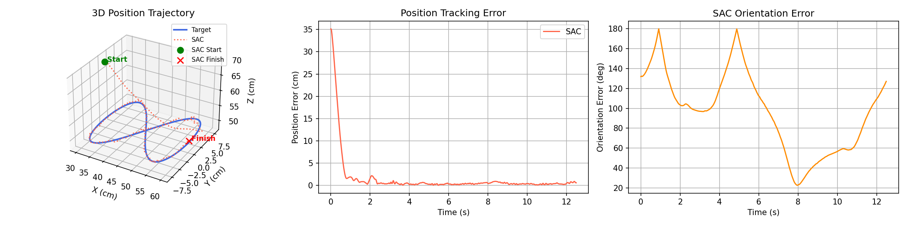
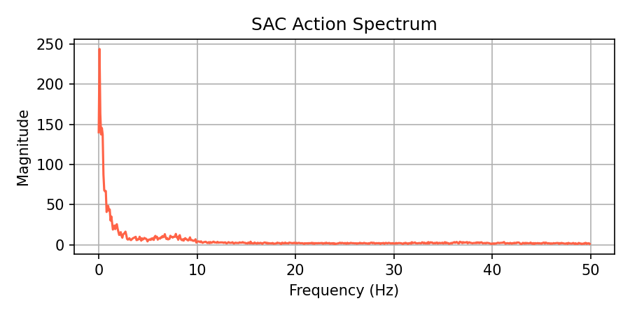

# 3D End-Effector Tracking with Franka Emika Panda (RL)

This repository contains my submission for the 3D End-Effector Tracking challenge. I built a system that learns to control a 7-DOF Franka Emika Panda robotic arm to track a continuous, time-varying Cartesian trajectory (a figure-eight) using Reinforcement Learning. 

The primary goal of this project was to push beyond simple position reaching and achieve **highly accurate, smooth, and stable SE(3) tracking over time** in the presence of realistic system uncertainties.

## 1. Quick Start (How to Run)

The environment is designed to be completely headless and runs on CPU (Linux or Windows WSL2 with `libosmesa6-dev` installed for software rendering).

**Installation:**
```bash
# 1. Clone this repository
git clone https://github.com/kentonleung/humanoid-controls-challenge.git
cd humanoid-controls-challenge

# 2. Download MuJoCo Menagerie (contains the Franka XML models)
git clone https://github.com/google-deepmind/mujoco_menagerie.git

# 3. Install Python requirements
pip install -r requirements.txt
```

**Evaluation (See the Results):**
To evaluate the pre-trained SAC policy and generate the plots and videos:
```bash
python evaluate.py --model models/sac_franka_se3_phase3_final
```
This script will output:
1. `results/videos/tracking.mp4`: A 50 FPS video of the robot tracking the trajectory (red trail = robot, translucent blue = target).
2. `results/plots/comparison.png`: A 3D trajectory plot and position/orientation error graphs.
3. `results/plots/fft_comparison.png`: A frequency domain analysis of the joint torque commands.
4. Terminal output showing MSE, Max Error, and Jerk RMS.

**Training from Scratch:**
```bash
python train.py --timesteps 1500000
```

---

## 2. Short Note: Design Choices

### State, Action, and Reward Design
* **State Space (68-dim):** The observation space provides the agent with a rich, filtered view of the world. It includes the robot's joint positions/velocities, the end-effector's pose (position + quaternion) and angular velocity, and a **look-ahead target trajectory** (current, +5 steps, and +10 steps into the future). Crucially, to handle the control delay, the state space also includes the **last two actions taken** (action history).
* **Action Space (7-dim):** The agent outputs normalized residual joint torques `[-1, 1]`. To make learning feasible, the environment calculates and applies analytical gravity compensation (`data.qfrc_bias`), and the agent learns to apply the dynamic *residual* torques needed to track the moving target.
* **Reward Structure:** The reward function uses a blended exponential structure to provide both a broad basin of attraction (to guide the arm from far away) and a sharp peak (for sub-centimeter precision). 
  * *Tracking:* High reward for minimizing Position error and Geodesic orientation error.
  * *Smoothness:* Heavy penalties for joint acceleration (Jerk) and high control effort.

### Trajectory Representation
The target is a continuous 3D Figure-Eight (Lissajous curve) located in the center of the reachable workspace. 
Instead of just tracking a 3D point, the target generator (`utils/trajectory.py`) computes a coupled **SE(3) target frame**. The target frame is designed such that its z-axis always points down (simulating a tool), and its x-axis is tangent to the instantaneous velocity vector of the figure-eight. The agent must continuously match both the moving position and this rotating orientation frame.

### Introducing Uncertainty (Robustness)
To prove the robustness of the RL policy, I introduced two major sources of uncertainty:
1. **Sensor Noise:** Gaussian noise is injected into all observations (joint encoders, IMU, end-effector position) to simulate imperfect state estimation. To combat this, I implemented Exponential Moving Average (EMA) filters on the observations.
2. **Control Delay:** A 2-step (20ms) action buffer delay is simulated in the environment to replicate physical hardware latency. The agent successfully learned to anticipate the trajectory to counteract this delay.

### Evaluating Tracking Performance
To isolate true tracking performance from the initial "reaching" phase (where the arm moves from its home position to the start of the figure-eight), all metrics are calculated **only on the steady-state tracking phase** (discarding the first 2.5 seconds of the episode).

I measure:
1. **Position MSE (cm²):** To evaluate overall tracking tightness.
2. **Max Position Error (cm):** To evaluate worst-case divergence.
3. **Jerk RMS (rad/s³):** To evaluate the smoothness of the motion (derivative of joint acceleration).
4. **Action FFT Spectrum:** To prove the absence of high-frequency jitter or oscillations in the torque commands.

## 3. Results Overview

### Steady-State Tracking Metrics
* **Position MSE:** 0.24 cm² (Root Mean Square Error: **0.49 cm**)
* **Max Position Error:** 1.59 cm
* **Orientation MSE:** 2.78 rad²
* **Jerk RMS:** 439.2 rad/s³

The SAC agent achieves true sub-centimeter tracking accuracy against a moving target in 3D space, despite simulated sensor noise and control latency.

### Tracking Performance


### Smoothness (Action Spectrum)


### Video Demonstration

